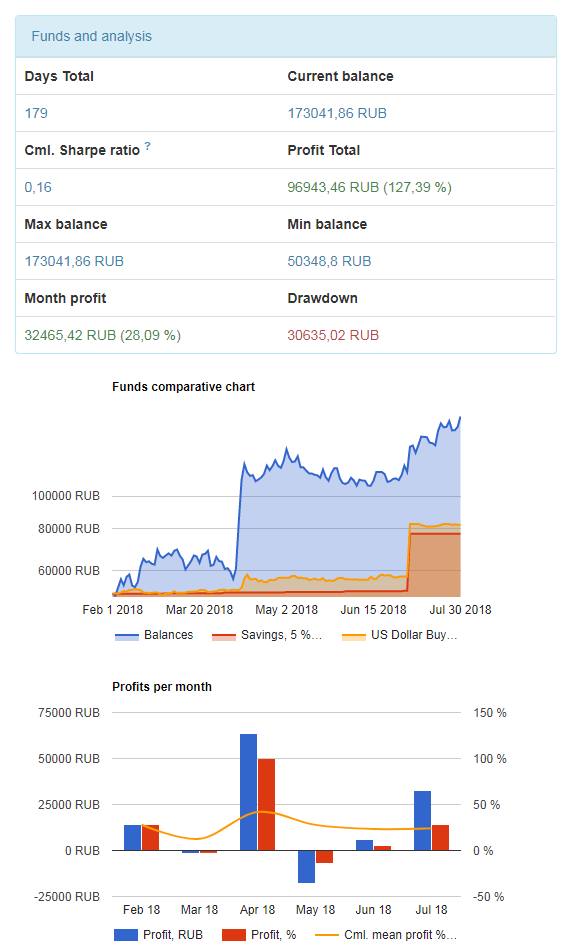

# Web interface for a non commercial private investing fund

It works on PostgreSQL, uses BootStrap as UI framework and is updated every day via REST API.
It has:
1) Home page with financial info and statistics (profits, Sharpe ratio, B&H curves, etc)
2) Private account page where info about your funds is displayed
3) Message page that allows you to send me a message via built-in SMTP server
4) Contacts page
5) REST API controller for intra-service communication.

Actual webConfig file is not included because of sensitive data.

Actual website: http://www.akinvest.tech

# Example interface screen shot

